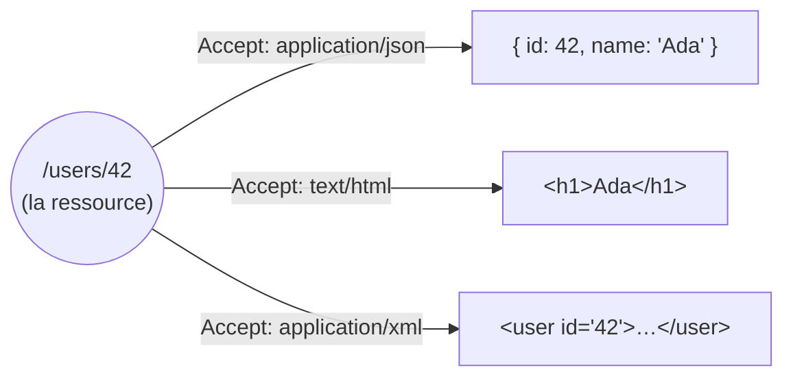
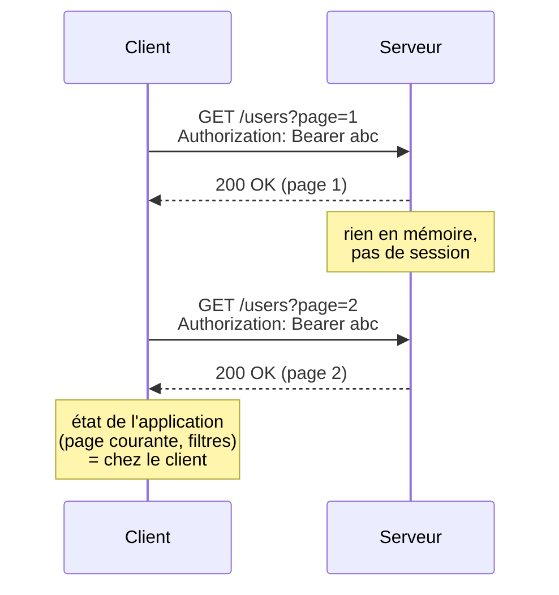
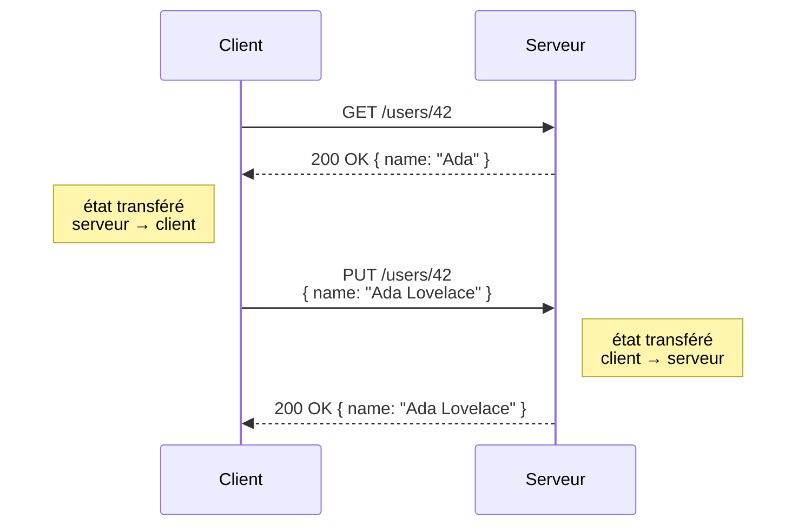
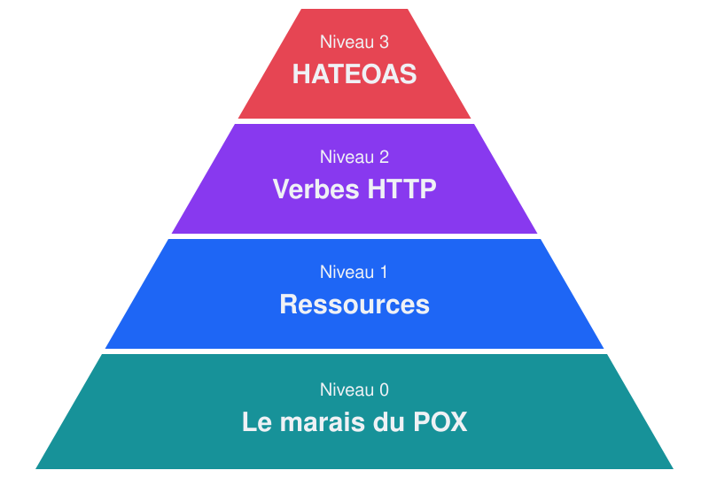
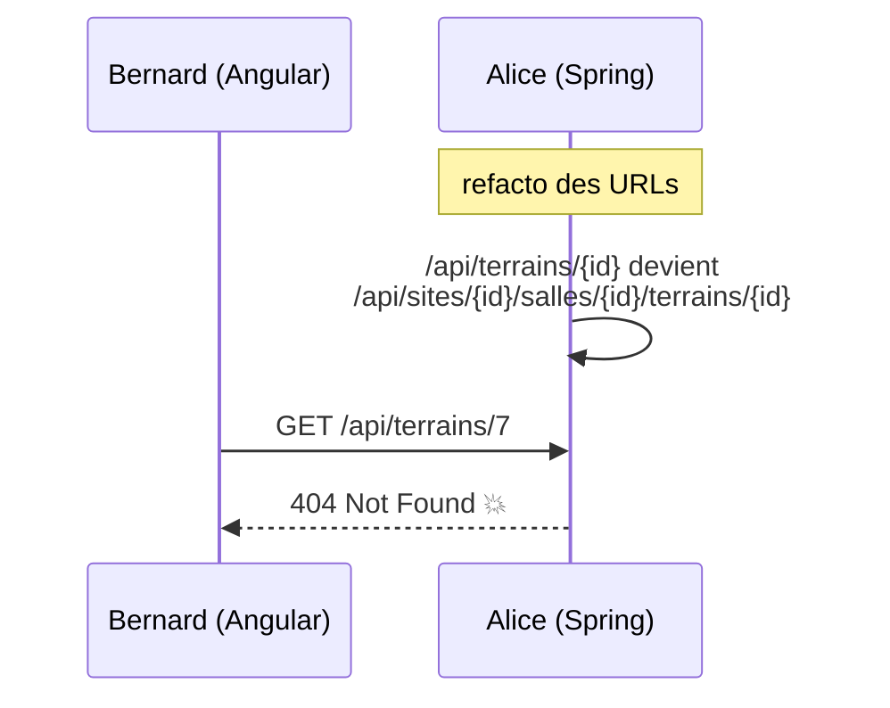
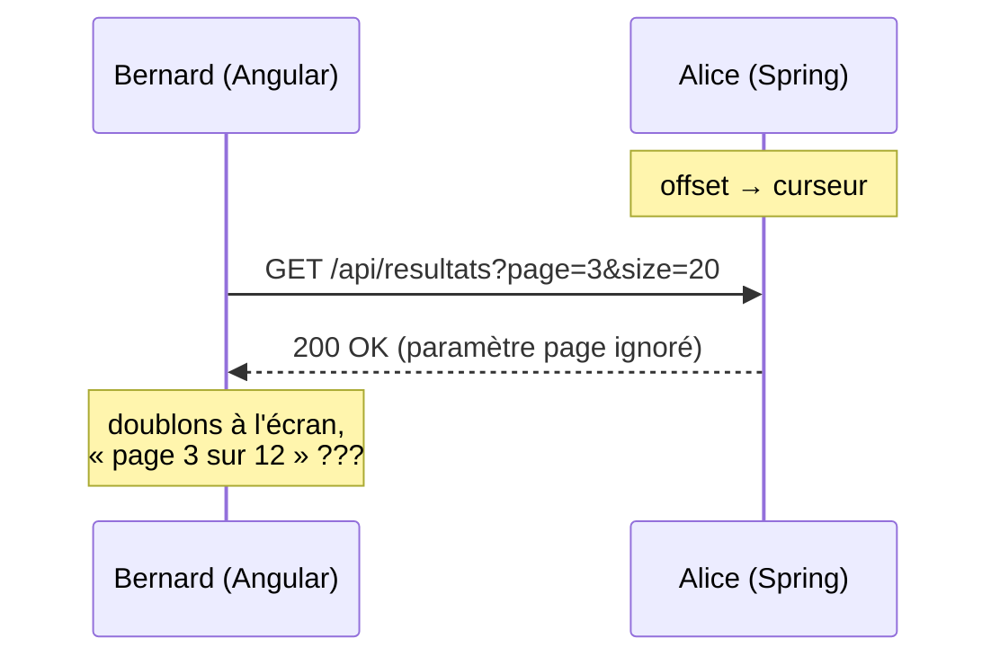
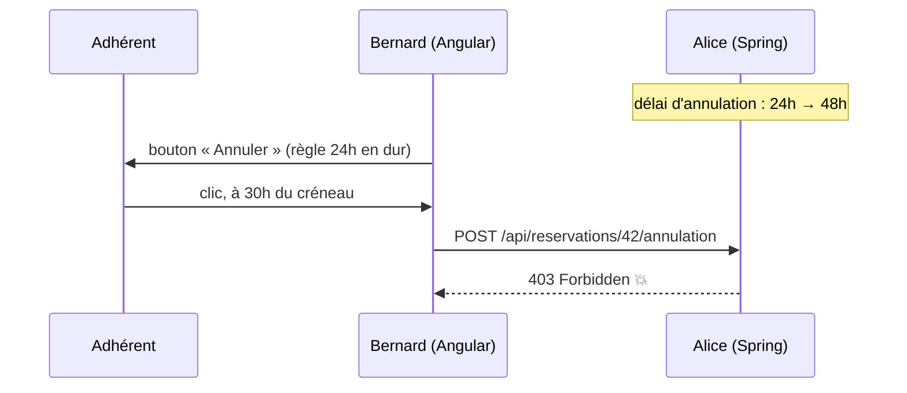
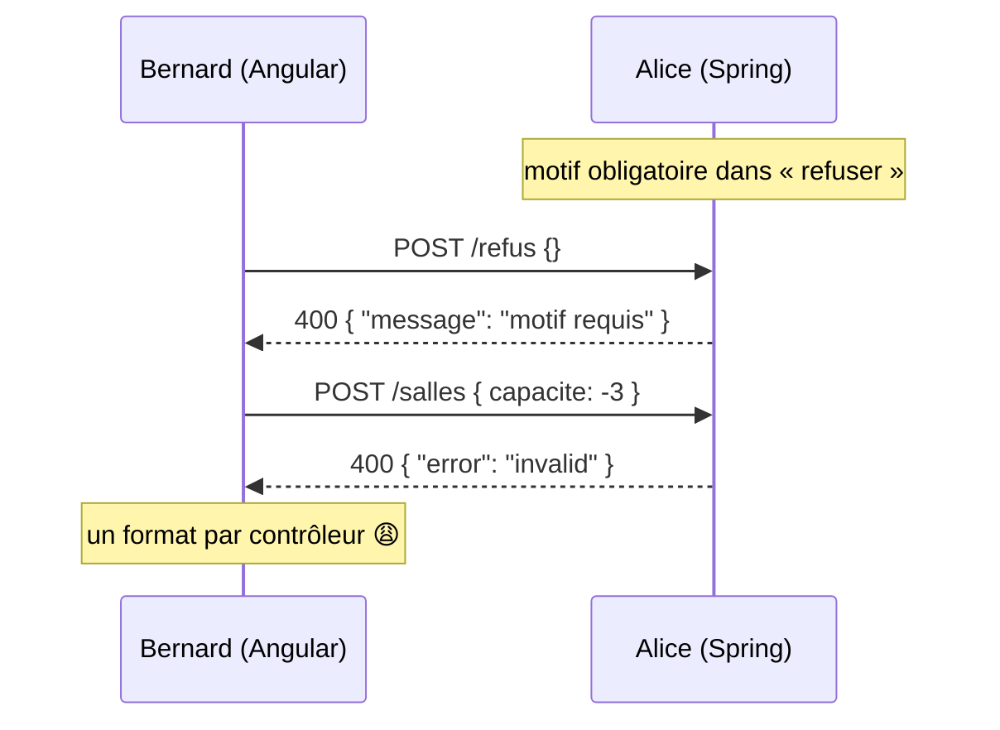
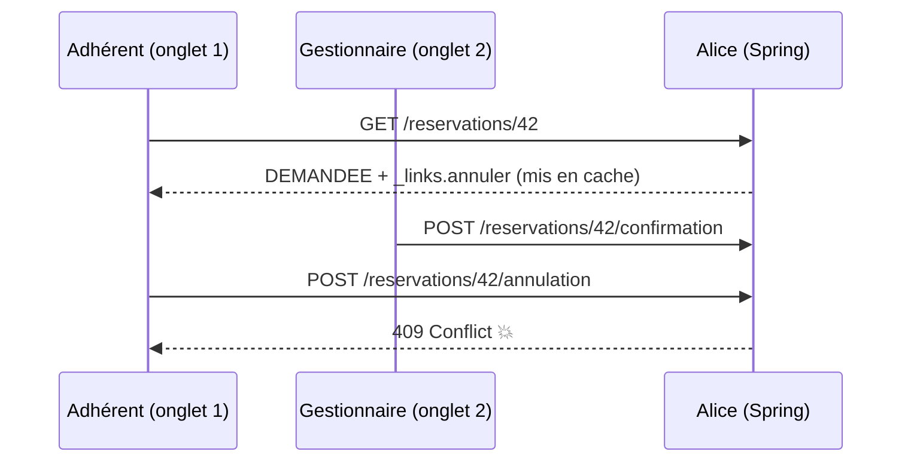

# HATEOAS+SPA,<br/> a love story 💘


## Introduction
- Benjamin Legrand / `@benjilegnard`
- Tech Lead @ __onepoint__<!-- .element class="poppins"-->
- Expert front, mais gros bagage ☕Java™<!-- .element class="fragment"-->
- (🅰️ngular/🍃spring-boot)<!-- .element class="fragment"-->
- Janvier 2026<!-- .element class="fragment"-->
Notes:
- présentation speaker
- qui connait déjà HATEOAS?
- 
- avant d'aborder HATEOAS, il faut qu'on parle de REST


### Ice Breaker: REST ?
 🧊 🪚
Notes:
- Qui a déjà développé ou utilisé des API's REST ici ?
- Qui s'est dèjà cassé les dents à expliquer ce que c'était.
- Ou dans un retour PR on vous a dit "C'est pas très RESTful ça"


### REST c'est quoi ?
> Une API REST, c'est une API dont le lead développeur a dit « c'est une API REST ».

<div class="trollface fragment"></div>

Notes:
- Une API REST, c'est une API dont le développeur a dit « c'est une API REST » en réunion, et personne n'a osé le contredire.
- Voilà, fin de la définition pratique utilisée par 95 % de l'industrie.
- comme Agile, Devops, MVP, diffusion sémantique, on utilise le mot sans son sens d'origine
- désolé, allez un peu plus sérieusement


### Plus sérieusement

- On renvoie du<!-- .element class="fragment"--> `JSON` sur du protocole `HTTP`
- Noms au pluriel dans tes URLs (<!-- .element class="fragment"-->`/users`, pas `/getUsers`)
- <!-- .element class="fragment"--> On fait du`GET` pour lire et `POST`... pour tout le reste
- Erreurs renvoyées en<!-- .element class="fragment"--> `200 OK` avec un corps de réponse :

```json
{
    "success": false,
    "error": "ça a planté"
}
```
<!-- .element class="fragment"-->

<div class="trollface fragment"></div>

Notes:
-  (/users, surtout pas /getUsers, on n'est pas des sauvages)
- Tu renvoies un 200 avec {"success": false, "error": "ça a planté"} dans le corps, parce que les codes HTTP c'est pour les faibles.
- Félicitations, si vous faites ça, ton LinkedIn peut désormais afficher « Expert REST ».
- Le titre il dit plus sérieusement, pas que c'est complètement sérieux.


### Sérieusement!

**RE**presentational **S**tate **T**ransfer
<br/>
*Roy Fielding*, thèse de doctorat (2000)
<br/>
<https://www.ics.uci.edu/~fielding/pubs/dissertation/top.htm>

Notes:
- soit en français « transfert d'état de représentation ».
- Le terme a été défini par Roy Fielding en 2000 dans sa thèse de doctorat, où il décrivait le style d'architecture qui sous-tend le Web.
- il passe depuis une partie de sa vie à expliquer que ce que tout le monde appelle REST n'en est pas


#### Representational (représentation)

Notes:
- le client ne manipule jamais directement une ressource (un utilisateur, une commande, un article), mais une représentation de celle-ci à un instant donné. 
- La même ressource peut être représentée en JSON, en XML, en HTML, etc. Le client et le serveur peuvent négocier le format, par exemple via l'en-tête HTTP Accept.
- Ca veut aussi dire que vous n'exposez pas vos entités de base de données directement hein, mais une "représentation de cette donnée"
- Et que vous pouvez avoir des ressources REST, destinées à une page / un écran (BFF)


#### State (état)


Notes:
- il s'agit de l'état de la ressource, mais aussi de l'état de l'application côté client.
- Comme les échanges sont sans état (stateless), le serveur ne conserve pas le contexte de la session du client entre deux requêtes : chaque requête contient tout ce qui est nécessaire pour être comprise.


#### Transfer (transfert)

Notes:
- cet état circule entre client et serveur à travers les représentations échangées. Quand tu fais un GET, le serveur te transfère l'état actuel de la ressource ; quand tu fais un PUT, c'est toi qui transfères un nouvel état au serveur.
- tout ça n'est ni une spec, ni une norme
- c'est un style d'architecture, un ensemble de contraintes


### Bref, Six contraintes
- une séparation client/serveur<!-- .element class="fragment"-->
- des échanges sans état<!-- .element class="fragment"-->
- des réponses qui disent si elles sont cachables<!-- .element class="fragment"-->
- un système en couches<!-- .element class="fragment"-->
- éventuellement du code à la demande<!-- .element class="fragment"-->
- et surtout une<!-- .element class="fragment"--> __interface uniforme__.
Notes:
- le minimum vital
- des échanges sans état (le serveur ne se souvient pas de toi, comme ton ex),
- un système en couches (le client ne sait pas s'il parle au vrai serveur ou à un proxy)
- éventuellement du code à la demande (la seule contrainte optionnelle, donc la seule que tout le monde respecte)
- gros problème c'est l'interface uniforme


---
## Prologue : La rencontre
- Alice, lead dev back <!-- .element class="fragment"-->(🍃 Spring Boot)
- Bernard, lead dev front<!-- .element class="fragment"--> ( 🅰️ Angular)
- Réunion de kickoff du projet ClubHub pour la FFATS<!-- .element class="fragment"-->

Notes:
- Alice (back, Spring Boot) et Bernard (front, Angular) construisent ClubHub
- FFATS tous les sports, on récupère tous les SIs de toutes les fédé et on en fait un nouveau par dessus !
- thème du devfest


### ClubHub
Fédération Francaise d'Absolument Touts les Sports
<br/>
Gestion de complexe multisport : salles, réservations, matériel.

Notes:
- Imaginer l'application (j'ai pas fini donc pas de démo)
- 6 rôles : visiteur, adhérent, coach, gestionnaire, arbitre, admin
- TODO


### La scène
```xkcd
A(point): Notre API sera RESTful !
B(shrug): Niveau 2, à tout casser.
A: Ok on visera le niveau HATEOAS
B(facepalm): ??? (🚪🏃)
```
Notes:
- réunion d'archi pour ClubHub
- Alice prononce le mot « HATEOAS », Bernard cherche la sortie de secours
- TODO
- Pour éviter les guéguerres de "est-ce qu'on est REST"


### Modèle de maturité de Richardson

Notes:
- Niveau 0 : un seul endpoint, tout en POST (coucou SOAP).
- Niveau 1 : des ressources distinctes.
- Niveau 2 : les bons verbes HTTP et les bons codes de statut, c'est là que vit l'immense majorité des « API REST ».
- Niveau 3 : HATEOAS, un endroit mythique dont on parle beaucoup mais que peu ont visité.


### HATEOAS
**H**ypermedia **A**s **T**he **E**ngine **O**f **A**pplication **S**tate
- chaque réponse doit contenir les liens vers les actions possibles ensuite.<!-- .element class="fragment"-->
- Le client ne devrait connaître qu'une URL d'entrée et naviguer comme un humain sur un site web, en cliquant sur des liens.<!-- .element class="fragment"-->
- Si ton frontend a 47 URLs codées en dur, ton API n'est pas REST, c'est du « RPC sur HTTP avec des URLs jolies »<!-- .element class="fragment"-->

Notes:
- concept évoqué dès 2000 dans la thèse de fielding
- article de blogs de 2008
- Donc le principe, c'est déjà qu'on va avoir un point d'entrée pour lister toutes nos apis,
- Puis offrir un moyen de naviguer entre elles


### Plusieurs specs
- JSON:API
- Siren
- JSON-LD/Hydra.
- __HAL__

Notes:
- il existe plusieurs facons de faire de l'hateoas et des liens entre resources
- TODO


### HAL

pour le coup c'est une spec

<https://datatracker.ietf.org/doc/html/draft-kelly-json-hal-11>


.


### Le contrat de base

`GET /api/reservations/42`
```
{
  "statut": "DEMANDEE",
}
```
Notes:
- basiquement, le niveau 2 
- beaucoup de nos api font juste ça 


### Le contrat du couple (2)

```json [3-6|7-9|10-15]
{
  "statut": "DEMANDEE",
  "_links": {
    "self":      { "href": "/api/reservations/42" },
    "confirmer": { "href": "/api/reservations/42/confirmation" }
  },
  "_embedded": {
    "terrain": { "nom": "Court 3", "_links": { "self": { "href": "..." } } }
  },
  "_templates": {
    "refuser": {
      "method": "POST",
      "properties": [{ "name": "motif", "required": true }]
    }
  }
}
```
Notes:
- HAL : `_links`, `_embedded`
- HAL-FORMS : `_templates`
- ProblemDetails pour les erreurs (chapitre 4)
- TODO


### Statut de la relation
*« C'est compliqué »*

Notes:
- TODO


### Takeaways
- ajouter des champs privés à nos entités


### Inconvénients
- client front doit le gérer de manière générique
- swagger/openapi pas bon avec ça (génère des SalleLinks, TerrainLinks etc...)
- ...
Notes:
- 


---
## Chapitre 1 : Premier rendez-vous
Liens, découvrabilité et `_embedded`

Notes:
- statut : premier rendez-vous
- Imaginons on a un début de dev
- côté back Alice décide unilatéralement de changer une url de resources


### Le bug

Notes:
- Alice réorganise l'API, vendredi 17h
- les URLs codées en dur de Bernard cassent en prod
- TODO


### Avant : Angular
```typescript [|4-5]
@Injectable({ providedIn: 'root' })
export class TerrainService {
  private http = inject(HttpClient);
  getTerrain(id: number) {
    return this.http.get<Terrain>(`/api/terrains/${id}`);
  }
}
```
Notes:
- une URL en dur, copiée depuis le Swagger
- TODO


### La dispute
```xkcd
B(armsup): Tu as changé l'URL !
A(shrug): Tu n'étais pas censé la connaître.
```
Notes:
- TODO
- 


### Le fix : Spring
```java [|1-2|5-8|9]
@GetMapping("/api")
RepresentationModel<?> racine(@AuthenticationPrincipal ClubUser user) {
  var racine = new RepresentationModel<>();
  racine.add(linkTo(RacineController.class).withSelfRel());
  if (user.hasRole("GESTIONNAIRE")) {
    racine.add(linkTo(SiteController.class).withRel("sites"));
    racine.add(linkTo(EquipementController.class).withRel("equipements"));
  }
  return racine;
}
```
Notes:
- `GET /api` renvoie les points d'entrée selon le rôle
- le seul point d'entrée connu du front
- TODO


### Le fix : Angular
```typescript [|1-3|5-6]
racine = httpResource<HalResource>(() => '/api');
menu = computed(() => Object.entries(this.racine.value()?._links ?? {})
    .map(([rel, { href }]) => ({ rel, href })));

href = input.required<string>(); // depuis la route
salle = httpResource<Salle>(() => this.href());
```
```html
@for (lien of menu(); track lien.rel) {
  <a routerLink="/explorer" [queryParams]="{ href: lien.href }">
    {{ lien.rel }}
  </a>
}
```
Notes:
- le menu est construit entièrement à partir de la racine
- on navigue site → salle → terrain → réservations en suivant les `_links`
- `httpResource()` : un signal d'URL qui re-fetch tout seul
- les routes Angular gardent l'état UI, les `_links` portent l'état serveur
- TODO


### Démo
~~Le détail d'une salle : URL en dur, puis lien suivi.~~
<https://api.github.com/>
Notes:
- pas de démo donc example 
- TODO


### La réplique
```xkcd
B(point): Pour afficher une salle et ses terrains,
  il me faut 1 + N appels.
A(facepalm): ...
```
Notes:
- Bernard a raison
- pourquoi c'est ça serait au front de faire 
- TODO


### Le fix rapide : `_embedded`
```java [|3-5|6-9]
@GetMapping("/api/salles/{id}")
RepresentationModel<?> salle(@PathVariable Long id) {
  var terrains = terrainRepository.findBySalle(id).stream()
      .map(terrainAssembler::toModel)
      .toList();
  var salle = salleAssembler.toModel(salleRepository.get(id));
  return HalModelBuilder.halModelOf(salle)
      .embed(terrains, LinkRelation.of("terrains"))
      .build();
}
```
Notes:
- un seul appel, chaque terrain garde ses propres `_links` et permissions
- le front lit `_embedded` s'il est présent, sinon il suit le lien (même code)
- TODO


### La contre-réplique
> Qui décide de ce qu'on embarque ?

Notes:
- tout embarquer : payloads lourds
- rien embarquer : retour aux N appels
- un choix de conception de l'API, à faire à deux
- en complément : le cache, avec le lien comme clé naturelle
- réinventer graphql
- TODO


### Takeaways
- découvrabilité
- changements non-cassants entre back/front 
- bien pour le crud a l'échelle
Notes:
- 

---
## Chapitre 2 : On emménage ensemble
La pagination

Notes:
- statut : on emménage ensemble
- TODO


### Le bug

Notes:
- le fil des derniers résultats devient trop gros
- Alice passe de l'offset au curseur
- TODO


### Avant : Angular
```typescript [|1-2|4-6]
page = signal(0);
resultats = httpResource(() => `/api/resultats?page=${this.page()}`);

totalPages = computed(() =>
  Math.ceil(this.resultats.value()!.total / 20)
);
```
```html
<span>page {{ page() + 1 }} sur {{ totalPages() }}</span>
```
Notes:
- Bernard calcule lui-même l'offset et le nombre de pages
- example simple, mais j'ai vu tellement de code custom
- TODO


### La dispute
```xkcd
B(armsup): Tu changes le contrat sans prévenir !
A(point): Le contrat, c'était next.
  C'est toi qui as fait le calcul.
```
Notes:
- TODO


### Le fix : Spring
```java [|2-3|4]
@GetMapping("/api/equipements")
PagedModel<EntityModel<Equipement>> liste(Pageable pageable) {
  Page<Equipement> page = equipementRepository.findAll(pageable);
  return pagedAssembler.toModel(page, equipementAssembler);
}
```
```json
"_links": { "first": …, "prev": …, "self": …, "next": …, "last": … }
```
Notes:
- `PagedResourcesAssembler` génère `first` / `prev` / `next` / `last`
- pour le fil des résultats : un seul lien `next` qui porte le curseur
- TODO


### Le fix : Angular
```typescript [|1-2]
url = signal('/api/equipements');
page = httpResource<HalPage<Equipement>>(() => this.url());
```
```html [1-6|7]
@for (rel of ['first', 'prev', 'next', 'last']; track rel) {
  <button [disabled]="!page.value()?._links[rel]"
          (click)="url.set(page.value()!._links[rel].href)">
    {{ rel }}
  </button>
}
<!-- fil des résultats : « load more » sur _links.next -->
```
Notes:
- le front ne calcule plus d'offset : le back décide, le front exécute
- « load more » : on concatène les éléments à chaque `next`
- TODO


### Démo
L'inventaire des équipements, puis le fil des résultats.

Notes:
- TODO


### La réplique
```text
/equipements?page=7&categorie=defibrillateur&site=nord
```
```xkcd
B(point): Je veux la query string.
A(shrug): Le lien suffit.
```
Notes:
- le gestionnaire veut une URL qu'il peut envoyer à un collègue
- où vit l'état de pagination et des filtres : query string ou store ?
- teaser du chapitre 5
- TODO


---
## Chapitre 3 : Crise de confiance
Les permissions

Notes:
- statut : crise de confiance
- TODO
- beaucoup d'applis font leur gestion de droits côté front
- je plaide coupable


### Le bug

Notes:
- le club passe le délai à 48h, Alice change la règle
- le front de Bernard affiche toujours le bouton
- en plus, l'horloge du navigateur n'est pas celle du serveur
- TODO


### Avant : Angular
```html [1-2]
@if (user().role === 'ADHERENT'
     && resa().debut.getTime() - Date.now() > 24 * 3600_000) {
  <button (click)="annuler()">Annuler</button>
}
```
Notes:
- la règle métier est copiée dans le front
- TODO


### La dispute
```xkcd
B(armsup): Qui t'a donné le droit de changer les règles ?
A(point): Qui t'a donné le droit de les copier ?
```
Notes:
- TODO


### Le fix : Spring
```java [|6-7|8-9|10-11]
public EntityModel<Reservation> toModel(Reservation resa) {
  var ctrl = methodOn(ReservationController.class);
  var user = currentUser();
  var model = EntityModel.of(resa,
      linkTo(ctrl.get(resa.id())).withSelfRel());
  if (policy.peutAnnuler(user, resa))
    model.add(linkTo(ctrl.annuler(resa.id())).withRel("annuler"));
  if (policy.peutConfirmer(user, resa))
    model.add(linkTo(ctrl.confirmer(resa.id())).withRel("confirmer"));
  if (policy.peutDupliquer(user, resa))
    model.add(linkTo(ctrl.dupliquer(resa.id())).withRel("dupliquer"));
  return model;
}
```
Notes:
- les actions dépendent de l'état **et** du rôle
- `annuler` (adhérent), `confirmer` / `refuser` (gestionnaire), `dupliquer` (coach)
- TODO


### Le fix : Angular
```html
@if (resa().can('annuler')) {
  <button (click)="resa().follow('annuler')">Annuler</button>
}
```
```typescript
can = (rel: string) => rel in this._links;
```
Notes:
- déclaratif : `@if` ou une directive d'attribut
- aucun `if (role === …)` dans le front
- TODO


### Démo
Changer de rôle, changer la règle, faire avancer un prêt.

Notes:
- on change de rôle dans le header : autres boutons, autres menus
- on passe de 24h à 48h dans le back : le front s'adapte sans redéploiement
- un prêt passe de `PRETE` à `RETOURNEE` : les actions changent à chaque étape
- TODO


### La réplique
```java [|2|5-6]
// l'assembler
if (resa.debut().isAfter(now().plusHours(48))) model.add(...annuler...);

// le contrôleur
@PreAuthorize("@clock.hoursBefore(#id) > 24")
@PostMapping("/api/reservations/{id}/annulation")
```
```xkcd
B(point): Ton lien dit oui, ton endpoint dit 403.
A(facepalm): ...
```
Notes:
- Alice a tort cette fois : la duplication a juste déménagé dans le back
- TODO


### La leçon
```java [|1-4|6|8-9]
@Component("reservationPolicy")
class ReservationPolicy {
  boolean peutAnnuler(User user, Reservation resa) { ... }
}

if (policy.peutAnnuler(user, resa)) model.add(...annuler...);

@PreAuthorize("@reservationPolicy.peutAnnuler(principal, #id)")
@PostMapping("/api/reservations/{id}/annulation")
```

Notes:
- une seule fonction de policy, utilisée par le lien et par le contrôle
- le front *montre*, le back *décide* : un bouton masqué n'est pas une protection
- transition : et cette 403, elle ressemble à quoi ?
- TODO


---
## Chapitre 4 : Présentation aux beaux-parents
Formulaires et erreurs

Notes:
- statut : présentation aux beaux-parents
- ch. 3 : le `_template` est présent, donc l'action existe
- ici : le `_template` décrit ses champs, donc le formulaire existe
- TODO


### Le bug

Notes:
- le formulaire de Bernard ignore le nouveau champ : des 400 en prod
- chaque contrôleur renvoie son propre format d'erreur
- TODO


### Avant : Angular
```typescript [|1-3|5-7]
refusForm = new FormGroup({
  motif: new FormControl(''), // obligatoire ? personne ne m'a prévenu
});

catchError(err =>
  of(err.error.message ?? err.error.error ?? 'Erreur inconnue')
)
```
Notes:
- validation dupliquée (ou oubliée)
- parsing des erreurs au cas par cas
- TODO


### La dispute

```xkcd
A(point): Ta validation est fausse.
B(point): Non, c'est la tienne.
```
<!-- -->
Notes:
- la vérité : il y a deux copies, donc une des deux a toujours tort
- TODO


### HAL-FORMS
Encore une spec
<http://rwcbook.com/hal-forms/>
Notes:
- déso pas déso


### Le fix : Spring, HAL-FORMS
```java [|1-4|6-8]
record Refus(@NotBlank String motif) {}
@PostMapping("/api/reservations/{id}/refus")
ResponseEntity<?> refuser(@PathVariable Long id,
                          @Valid @RequestBody Refus refus)

var ctrl = methodOn(ReservationController.class);
model.add(linkTo(ctrl.get(id)).withSelfRel()
    .andAffordance(afford(ctrl.refuser(id, null))));
```
```json
"_templates": { "refuser": { "method": "POST",
  "properties": [{ "name": "motif", "required": true }] } }
```
Notes:
- Spring HATEOAS génère le template à partir du DTO et de ses annotations de validation
- attention : la première affordance d'un lien s'appelle `default` dans `_templates`
- TODO


### Le fix : Angular, HAL-FORMS
```typescript [|1-2|3-8]
model = signal<Record<string, unknown>>({});
refusForm = form(this.model, (path) => {
  for (const p of this.template().properties) {
    if (p.required) required(path[p.name]);
    if (p.regex) pattern(path[p.name], new RegExp(p.regex));
    if (p.min != null) min(path[p.name], p.min);
    if (p.max != null) max(path[p.name], p.max);
  }
});
```
Notes:
- signal forms générés à partir des `_templates` : `refuser`, `signaler-panne`, `creer-salle`
- `options` statiques (gravité de la panne) ou distantes via `options.link` (sports compatibles)
- TODO


### Le fix : Spring, ProblemDetail
```java [|1-3|4-7|8]
@ExceptionHandler(MethodArgumentNotValidException.class)
ProblemDetail validation(MethodArgumentNotValidException ex) {
  var problem = ProblemDetail.forStatus(HttpStatus.BAD_REQUEST);
  problem.setProperty("errors", ex.getFieldErrors().stream()
      .map(e -> Map.of("field", e.getField(),
                       "message", e.getDefaultMessage()))
      .toList());
  return problem;
}
```
Notes:
- RFC 9457, `spring.mvc.problemdetails.enabled=true`
- un seul format `application/problem+json` : `type`, `title`, `status`, `detail`, `instance`
- par défaut, Spring ne met pas les erreurs par champ dans la réponse : extension `errors`
- la 403 du ch. 3 et la 409 du ch. 5 utilisent le même format
- TODO


### Le fix : Angular, ProblemDetail
```typescript [|2|4-5]
export const problemInterceptor: HttpInterceptorFn = (req, next) => {
  const problems = inject(ProblemStore);
  return next(req).pipe(catchError((err: HttpErrorResponse) => {
    problems.set(err.error as ProblemDetail);
    return throwError(() => err.error);
  }));
};
```
```html
<input [field]="refusForm.motif" />
<span>{{ problems.forField('motif') }}</span>
```
Notes:
- un seul intercepteur
- les erreurs par champ sont mappées sur les champs du signal form généré
- TODO : vérifier le nom de la directive signal forms (`[field]` ou `[formField]`) selon la version d'Angular
- TODO


### Démo
Ajouter `niveauGravite` au template `signaler-panne`.

Notes:
- le champ apparaît avec sa validation
- on soumet une valeur que seul le back refuse : l'erreur s'affiche sous le bon champ
- TODO


### La réplique
```json
"properties": [
  { "name": "creneau", "widget": "calendar-grid", "draggable": true }
]
```
```xkcd
A(armsup): J'ajoute widget: 'calendar-grid' dans le template !
B(facepalm): Non.
```
Notes:
- la designer veut le planning hebdomadaire des salles, grille calendrier et drag & drop
- le back choisit alors les widgets UI : c'est la ligne rouge
- démo honnête : ici, le générique craque, et Bernard code du sur-mesure
- TODO


---
## Chapitre 5 : Thérapie de couple
À qui appartient l'état ?

Notes:
- statut : thérapie de couple
- TODO


### Le bug

Notes:
- Bernard met les réservations en cache dans un store global
- l'adhérent voit encore « Annuler » : données *et* liens périmés
- TODO


### Avant : la 409
```json
{
  "type": "https://clubhub.fr/problems/etat-invalide",
  "title": "Transition impossible",
  "status": 409,
  "detail": "La réservation 42 est déjà CONFIRMEE",
  "instance": "/api/reservations/42/annulation"
}
```
Notes:
- le même format ProblemDetails qu'au chapitre 4
- TODO


### La dispute
```xkcd
A(point): C'est moi la source de vérité.
B(armsup): Alors pourquoi mon bouton met 400 ms à réagir ?
  Je veux de l'UI optimiste.
```
Notes:
- TODO


### La séance de thérapie
- État serveur : Alice, avec ses liens
- État UI : Bernard (routes, filtres, sélection)

Notes:
- l'état serveur appartient à Alice, avec ses liens
- l'état UI appartient à Bernard : routes, filtres, sélection, query params
- les solutions actuelles et leurs limites
- réponse au teaser du ch. 2 : l'état de pagination et des filtres vit dans les query params
- TODO


### Le fix : Angular, sans store
```typescript [|1|3-7]
resa = httpResource<HalResource<Reservation>>(() => this.selfHref());

annuler() {
  this.resa.value()!.follow('annuler').subscribe({
    error: (p: ProblemDetail) => p.status === 409 && this.resa.reload(),
  });
}
```
Notes:
- au départ : signals + `httpResource()`, sans store
- sur une 409, on recharge le lien `self` : les nouvelles actions arrivent avec les nouvelles données
- TODO


### Le fix : Angular, ngrx-hateoas
```typescript
export const ReservationStore = signalStore(
  withHypermediaResource('reservation', initialReservation),
  withHypermediaAction('annuler'),
);
```
Notes:
- ngrx-hateoas / SignalStore arrive seulement quand le besoin apparaît
- TODO : vérifier l'API exacte de ngrx-hateoas
- TODO


### Démo
ngrx-hateoas dans ClubHub, puis le module Compétitions « presque gratuitement ».

Notes:
- TODO


### La réplique
```xkcd
A(shrug): Score live et UI optimiste ?
B(shrug): HATEOAS n'est pas le bon outil.
```
Notes:
- pour une fois, Alice et Bernard sont d'accord
- TODO


---
## Épilogue : Mariage ou rupture ?

Notes:
- TODO


### Le contrat de mariage
HAL + HAL-FORMS = ❤️

Notes:
- Pour conclure
- on peut aller plus loin que le simple REST
- TODO


### Avantages
- standardisation des échanges<!-- .element class="fragment" -->
- découvrabilité<!-- .element class="fragment" -->
- source unique de vérité<!-- .element class="fragment" -->
- moins de duplication<!-- .element class="fragment" -->
- formulaires et navigation génériques<!-- .element class="fragment" -->
- couplage faible aux URLs<!-- .element class="fragment" -->
- Angular moderne rend cette relation plus vivable qu'avant<!-- .element class="fragment" -->
Notes:
- standardisation des échanges
- découvrabilité: l'API se documente elle-même, le front explore les `_links`
- source unique de vérité: le back décide, le front exécute (permissions, navigation)
- moins de duplication: permissions, pagination, validation ne vivent plus en double
- formulaires et navigation génériques: on code une fois, ça marche partout
- couplage faible aux URLs: le back peut bouger ses routes sans casser le front
- Angular moderne (signals + `resource()` + ngrx-hateoas) rend cette relation vivable
- Specs vieilles : Les LLMs ont ça dans leur entrainement


### Inconvénients / quand ne pas utiliser

- nécéssite une certaine échelle<!-- .element class="fragment" -->
- dès qu'on sort du générique<!-- .element class="fragment" -->
- verbosité / poids des payloads<!-- .element class="fragment" -->
- courbe d'apprentissage et culture d'équipe<!-- .element class="fragment" -->
- performance / first paint : attention aux allers-retours pour « découvrir » l'API / créer les forms<!-- .element class="fragment" -->
- pas adapté aux apps très offline-first<!-- .element class="fragment" -->
Notes:
- nécéssite une certaine échelle nombre d'APIs / entités à gérer.
- sortir du générique: dès que l'UX devient trop spécifique.
- verbosité / poids des payloads (`_links` partout)
- courbe d'apprentissage et culture d'équipe (back ET front doivent jouer le jeu)
- couplage fort à un back non-discipliné: si l'API triche, tout s'écroule
- performance / first paint : attention aux allers-retours pour « découvrir » l'API
- pas adapté aux apps très offline-first ou très optimistes côté UI


### Pour conclure

- HATEOAS: curseur entre « back source de vérité », « API orientées métier » et « front autonome »<!-- .element class="fragment" -->
- à adopter pour le générique et le piloté-par-permissions, à éviter pour le sur-mesure<!-- .element class="fragment" -->
- suivre les liens, pas les URLs; afficher ce que le back autorise<!-- .element class="fragment" -->
- on passe de HATEOAS uniquement au niveau « client d'API » à HATEOAS au niveau de la gestion d'état / formulaires<!-- .element class="fragment" -->
Notes:
- 


### 💘
```json
{
  "_links": {
    "self": { "href": "/alice" },
    "love": { "href": "/bernard" }
  }
}
```
Notes:
- Bernard sait quoi en faire
- Attention aux RH
- TODO


### Sources
- restguide : <https://www.restguide.info/hateoas>
- specs : 
  - HAL : <https://stateless.co/hal_specification.html>
  - HAL-FORMS : <http://rwcbook.com/hal-forms/>
- libs front :
  - librairie ngrx-hateoas : <https://angular-architects.github.io/ngrx-hateoas/>
  - ngx-hateoas-client : <https://github.com/lagoshny/ngx-hateoas-client>
- implémentations côté back.
  - java/spring-boot : <https://docs.spring.io/spring-hateoas/docs/current/reference/html/>
  - node.js : <https://www.npmjs.com/package/hal>
  - C#/dotnet : <https://github.com/danielmurrmann/Fancy.ResourceLinker>


### Sources (2)
- essai de roy fielding : <https://ics.uci.edu/~fielding/pubs/dissertation/>
- modèle de maturité de richardson https://martinfowler.com/articles/richardsonMaturityModel.html
- comics / conversations inspirées de [XKCD](https://xkcd.com)
- police XKCD sous licence CC BY-NC 3.0 récupérée de <https://github.com/ipython/xkcd-font>


### Slides
<https://github.com/benjilegnard/hateoas-and-spa-a-loveoas-story/>


