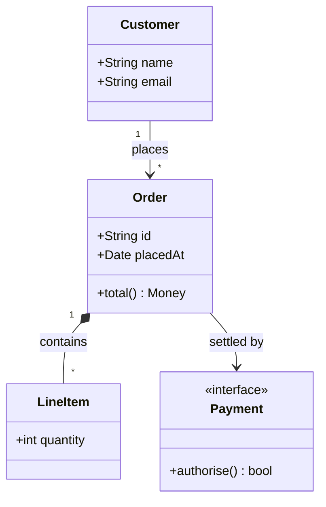
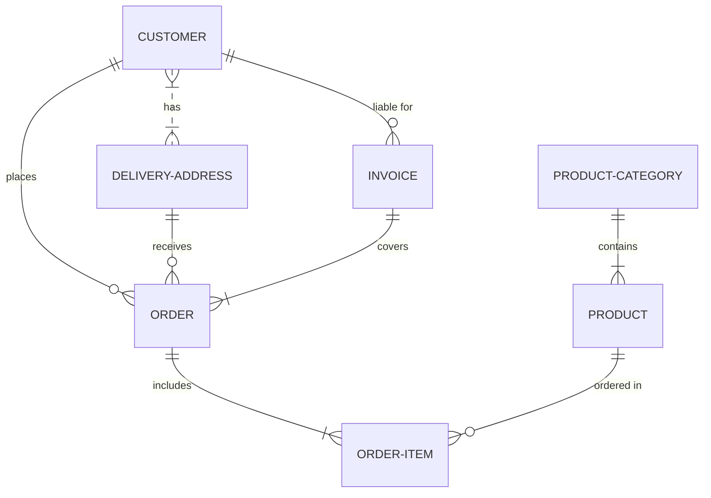
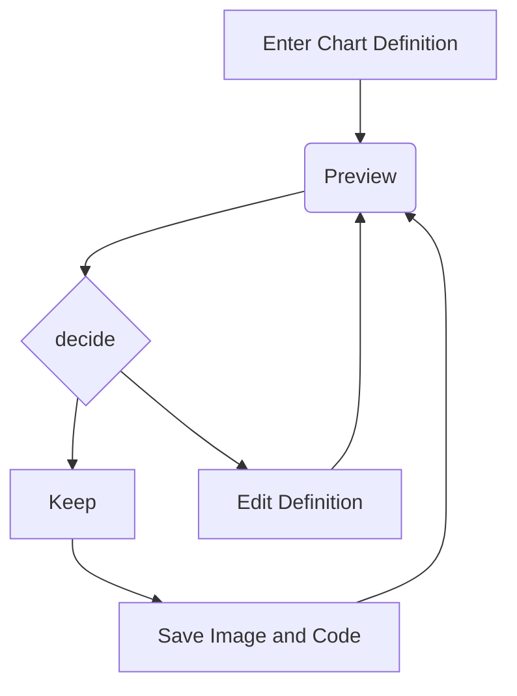
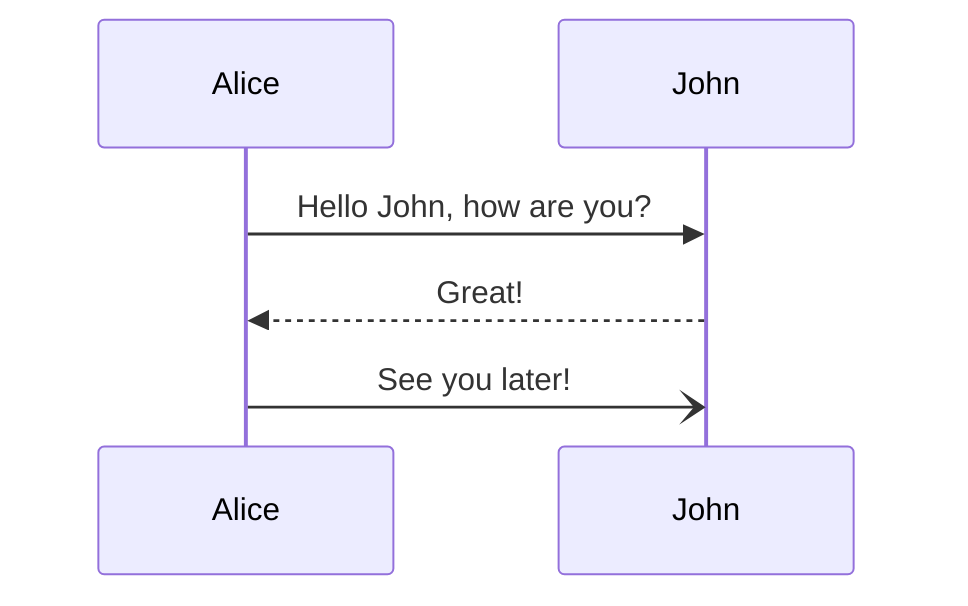
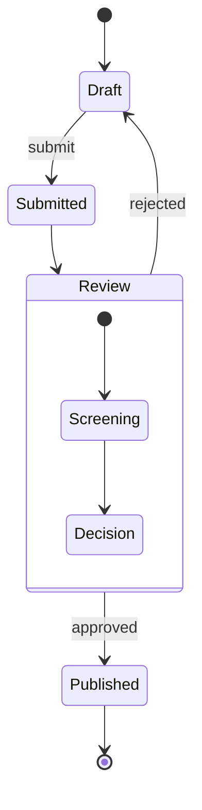

# HATEOAS+SPA,<br/> a love story 💘


## Introduction

















```typescript
export interface PaginationState {
  currentPage: number;
  pageSize: number;
  totalElements: number;
  totalPages: number;
  /**
   * Active sort clause(s). Defaults to `undefined` (let the server decide its
   * default ordering); set an app-specific default via the `withPagination`
   * initial-state override.
   */
  sort: string | string[] | undefined;
  /** IDs of the entities that belong to the current page, in server order. */
  currentPageIds: EntityId[];
}

```
