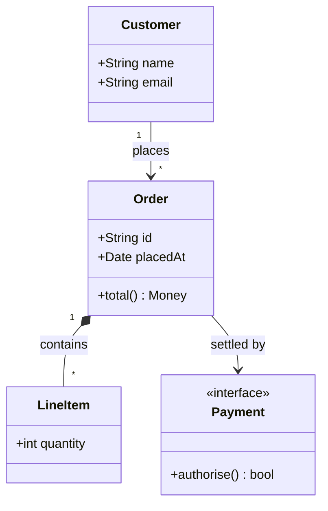
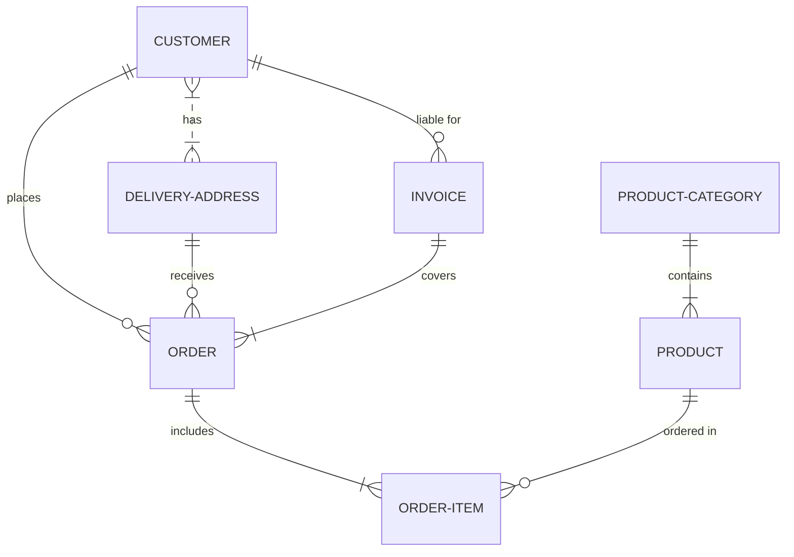
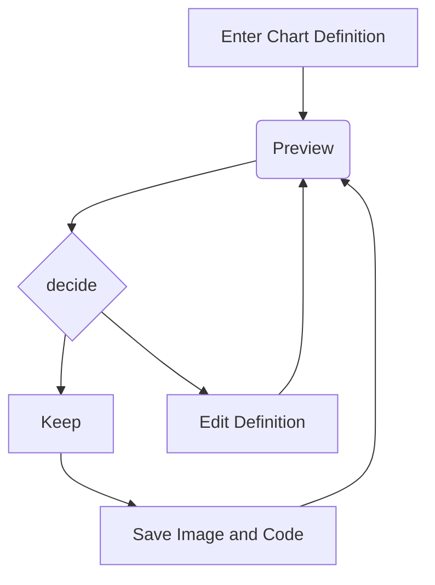
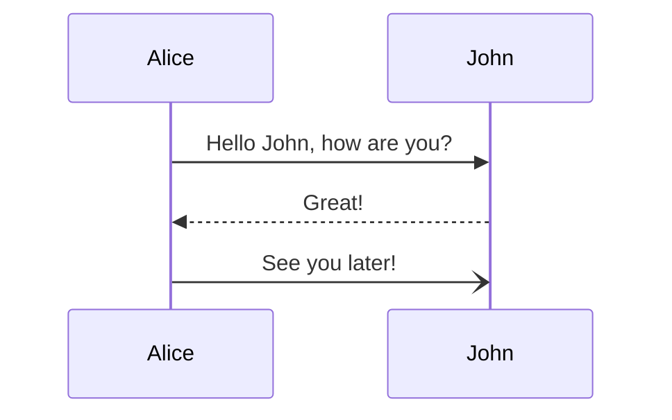
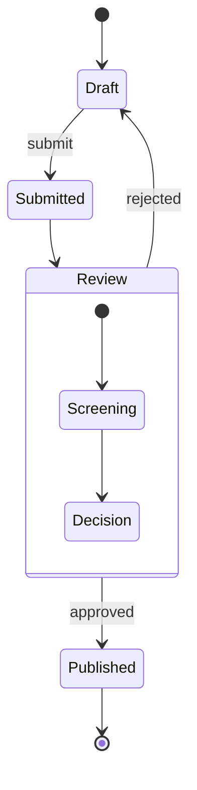

# HATEOAS+SPA,<br/> a love story 💘


## Introduction
- Benjamin Legrand / `@benjilegnard`
- Tech Lead @ __onepoint__<!-- .element class="poppins"-->
- Expert front, mais gros bagage ☕Java™
- (🅰️ngular/🍃spring-boot)
Notes:
- présentation speaker
- avant d'aborder HATEOAS, il faut qu'on parle de REST


### Ice Breaker: REST ?
 🧊 🪚
Notes:
- Qui a déjà développé ou utilisé des API's REST ici ?
- Qui s'est dèjà cassé les dents à expliquer ce que c'était.
- Ou dans un retour PR on vous a dit "C'est pas très RESTful ça"


### REST c'est quoi ?
> Une API REST, c'est une API dont le développeur a dit « c'est une API REST »

🧌<!-- .element class="fragment"-->

Notes:
- Une API REST, c'est une API dont le développeur a dit « c'est une API REST » en réunion, et personne n'a osé le contredire. Voilà, fin de la définition pratique utilisée par 95 % de l'industrie.
- désolé, allez un peu plus sérieusement


### Plus sérieusement

- On renvoie du `JSON` sur du protocole `HTTP`
- Noms au pluriel dans tes URLs (`/users`, pas `/getUsers`)
- `GET` pour lire et `POST` pour tout le reste
- Erreurs en 200 OK avec un corps de réponse 

```json
{
    "success": false,
    "error": "ça a planté"
}
```
<!-- .element class="fragment"-->

🧌<!-- .element class="fragment"-->

Notes:
-  (/users, surtout pas /getUsers, on n'est pas des sauvages)
- Tu renvoies un 200 avec {"success": false, "error": "ça a planté"} dans le corps, parce que les codes HTTP c'est pour les faibles.
- Félicitations, ton LinkedIn peut désormais afficher « Expert REST ».


### Sérieusement!

- **RE**presentational **S**tate **T**ransfer
- *Roy Fielding*, thèse de doctorat (2000)<!-- .element class="fragment"-->
- 🌐 Description du web<!-- .element class="fragment"-->
<!-- // TODO QRcode / lien thèse -->
Notes:
- soit en français « transfert d'état de représentation ».
- Le terme a été défini par Roy Fielding en 2000 dans sa thèse de doctorat, où il décrivait le style d'architecture qui sous-tend le Web.
- il passe depuis une partie de sa vie à expliquer que ce que tout le monde appelle REST n'en est pas


#### Representational (représentation)
```mermaid
// TODO 
```
Notes:
- le client ne manipule jamais directement une ressource (un utilisateur, une commande, un article), mais une représentation de celle-ci à un instant donné. La même ressource peut être représentée en JSON, en XML, en HTML, etc. Le client et le serveur peuvent négocier le format, par exemple via l'en-tête HTTP Accept.


#### State (état)
```mermaid
// TODO 
```

Notes:
- il s'agit de l'état de la ressource, mais aussi de l'état de l'application côté client. Comme les échanges sont sans état (stateless), le serveur ne conserve pas le contexte de la session du client entre deux requêtes : chaque requête contient tout ce qui est nécessaire pour être comprise.


#### Transfer (transfert)
```mermaid
// TODO 
```
Notes:
- cet état circule entre client et serveur à travers les représentations échangées. Quand tu fais un GET, le serveur te transfère l'état actuel de la ressource ; quand tu fais un PUT, c'est toi qui transfères un nouvel état au serveur.


### Bref, Six contraintes
- une séparation client/serveur
- des échanges sans état (le serveur ne se souvient pas de toi, comme ton ex),
- des réponses qui disent si elles sont cachables
- un système en couches (le client ne sait pas s'il parle au vrai serveur ou à un proxy)
- éventuellement du code à la demande (la seule contrainte optionnelle, donc la seule que tout le monde respecte)
- et surtout une interface uniforme.
Notes:
- le minimum vital
- gros problème c'est l'interface uniforme


### HATEOAS
- chaque réponse doit contenir les liens vers les actions possibles ensuite.
- Le client ne devrait connaître qu'une URL d'entrée et naviguer comme un humain sur un site web, en cliquant sur des liens.
- Si ton frontend a 47 URLs codées en dur, ton API n'est pas REST, c'est du « RPC sur HTTP avec des URLs jolies »

Notes:
- concept évoqué dès la thèse


---
## Démos reveal.js/mermaid
















```typescript
export interface PaginationState {
  currentPage: number;
  pageSize: number;
  totalElements: number;
  totalPages: number;
  /**
   * Active sort clause(s). Defaults to `undefined` (let the server decide its
   * default ordering); set an app-specific default via the `withPagination`
   * initial-state override.
   */
  sort: string | string[] | undefined;
  /** IDs of the entities that belong to the current page, in server order. */
  currentPageIds: EntityId[];
}

```
